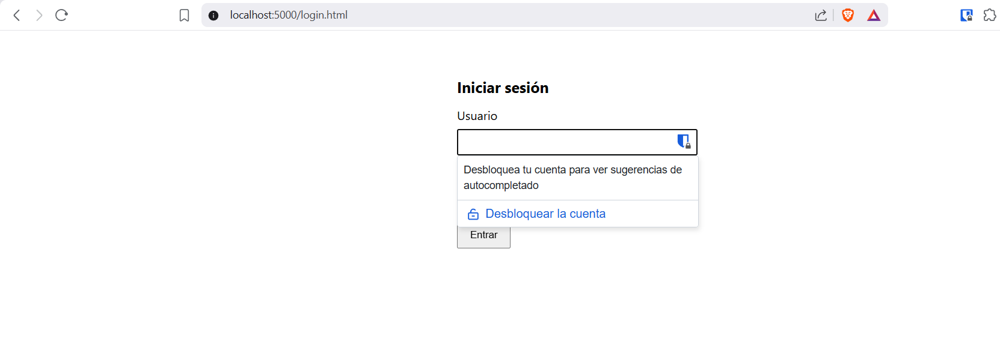
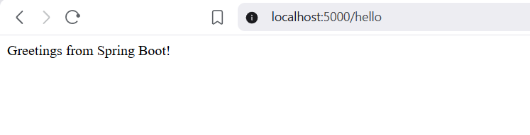

# Lab 9 TDSN — Backend (Spring Boot)

API REST segura con Spring Boot 3, Spring Security y Thymeleaf.

## Arquitectura general

```
Browser ──HTTPS──▸ Apache httpd (SSL, ServidorSeguro)
                        │
                        ▼
                   Nginx container (apache-client, :5000)
                        │
                        ▼
                   Spring Boot (AppServer, :5000)
```

- **ServidorSeguro**: termina TLS (Let's Encrypt), reverse proxy hacia el contenedor Nginx.
- **Nginx (apache-client)**: sirve el frontend estático y reenvía `/api/*`, `/login`, `/hello`, `/logout` al backend.
- **AppServer**: ejecuta esta aplicación Spring Boot.

## Stack

- Java 17 / Maven
- Spring Boot 3.2.5
- Spring Security (form login + HTTP Basic + CSRF via cookie)
- Thymeleaf + SpringSecurity dialect
- Docker (imagen multi-stage)

## Endpoints

| Método | Ruta | Acceso | Respuesta |
|--------|------|--------|-----------|
| GET | `/login.html` | Público | Formulario de login (Thymeleaf) |
| POST | `/login` | Público | Procesamiento de autenticación |
| GET | `/hello` | Autenticado | Saludo en texto plano |
| GET | `/api/hello` | Autenticado (Basic) | `{"message":"...","secure":"true"}` |
| POST | `/logout` | Autenticado | Cierra sesión |

Credenciales de demo: `admin` / `admin123` (BCrypt).

## Variables de entorno

| Variable | Descripción | Default |
|----------|-------------|---------|
| `PORT` | Puerto del servidor | `5000` |
| `SSL_ENABLED` | Habilitar TLS nativo | `false` |
| `KEY_STORE_PATH` | Ruta al keystore PKCS12 | `classpath:keystore/ecikeystore.p12` |
| `KEY_STORE_PASSWORD` | Contraseña del keystore | — |
| `KEY_ALIAS` | Alias del certificado | `ecikeypair` |
| `CORS_ALLOWED_ORIGINS` | Orígenes permitidos (CSV) | — |

## Ejecución local

```bash
mvn spring-boot:run
```

Acceder a `http://localhost:5000/login.html`.

## Docker

### Construir la imagen

```bash
docker build -t <usuario>/<nombre-imagen>:latest .
```

### Ejecutar el contenedor

```bash
docker run -d --name <nombre-contenedor> \
  -p 5000:5000 -e PORT=5000 -e SSL_ENABLED=false \
  <usuario>/<nombre-imagen>:latest
```

### Despliegue en la nube

```bash
docker pull <usuario>/<nombre-imagen>:latest
docker run -d --name <nombre-contenedor> --restart unless-stopped \
  -p 5000:5000 -e PORT=5000 -e SSL_ENABLED=false \
  <usuario>/<nombre-imagen>:latest
```

Security Group: abrir puerto `5000/tcp` desde la IP privada del servidor proxy.

## Funcionalidades de seguridad

### Autenticación dual

La aplicación soporta dos mecanismos de autenticación simultáneos configurados en `SecurityConfig.java`:

- **Form Login**: formulario Thymeleaf en `/login.html` que envía credenciales vía POST a `/login`. Tras autenticación exitosa, Spring redirige a `/hello`. Ideal para navegación interactiva.
- **HTTP Basic**: header `Authorization: Basic` en cada petición. Utilizado por el frontend JavaScript para consumir `/api/hello` sin depender de sesión.

### Contraseñas con hash (BCrypt)

Las contraseñas nunca se almacenan en texto plano. Se usa `BCryptPasswordEncoder` para generar el hash al registrar el usuario y verificarlo durante el login. Aunque este proyecto usa un usuario en memoria, el mecanismo es idéntico al de producción con base de datos.

### Protección CSRF

Se utiliza `CookieCsrfTokenRepository` con `CsrfTokenRequestAttributeHandler`:

- El token CSRF se almacena en una cookie `XSRF-TOKEN` accesible desde JavaScript.
- Los formularios Thymeleaf incluyen automáticamente el token como campo oculto vía `th:action`.
- Las peticiones AJAX (como el logout desde `app.js`) leen la cookie y envían el token en el header `X-XSRF-TOKEN`.

Esta configuración es compatible con reverse proxies (Apache httpd → Nginx → Spring).

### TLS / HTTPS

- En producción, Apache httpd termina TLS con certificados Let's Encrypt y reenvía al backend por HTTP interno.
- Spring confía en los headers `X-Forwarded-Proto` y `X-Forwarded-Port` gracias a `server.forward-headers-strategy=framework` en `application.properties`.
- Opcionalmente, Spring puede habilitar TLS nativo con un keystore PKCS12 (`SSL_ENABLED=true`).

### CORS

Configurado condicionalmente: solo se activa si la variable `CORS_ALLOWED_ORIGINS` está definida. Aplica únicamente a rutas `/api/**`, permitiendo métodos estándar con credenciales. En el despliegue con reverse proxy (mismo origen), no es necesario.

### Autorización de rutas

| Acceso | Rutas |
|--------|-------|
| Público | `/login`, `/login.html`, `/error`, `/css/**`, `/js/**`, `/webjars/**` |
| Autenticado | Cualquier otra ruta (`/hello`, `/api/hello`, `/logout`, etc.) |

## Estructura del proyecto

```
src/main/java/com/lab/secureweb/
├── SecurewebApplication.java
├── HelloController.java          # GET /hello, /api/hello
├── LoginController.java          # GET /login, /login.html
├── SecureUrlReader.java
└── config/
    ├── SecurityConfig.java       # Spring Security (CSRF, auth, CORS)
    └── ThymeleafSecurityConfig.java
src/main/resources/
├── application.properties
└── templates/login.html          # Formulario Thymeleaf
```

## Video de despliegue en AWS

Despliegue completo de ambos servicios (backend Spring Boot y frontend Nginx) en instancias EC2:

[](https://www.youtube.com/watch?v=-a7xEHltqSo)

## Evidencias de funcionamiento

### Formulario de login (local)



### Respuesta /hello tras autenticación (local)


